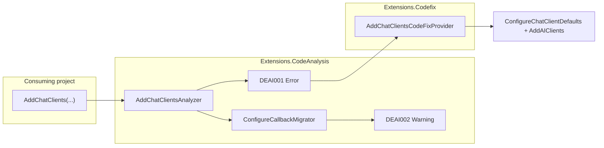

# DEAI001 — AddChatClients migration analyzer and code fix

This document describes the Roslyn analyzer and code fix that replace agent-only migration guidance in [`src/Extensions/SKILL.md`](../src/Extensions/SKILL.md) with deterministic IDE and build-time support.

## Background

`AddChatClients` was removed from `Devlooped.Extensions.AI` in favor of:

- `AddAIClients` — configuration-driven client registration
- `ConfigureChatClientDefaults` — default pipelines (global or per configuration section)

The old API accepted an inline `configure: (name, b) => ...` callback. The new API has no direct equivalent; that logic must move to one or more `ConfigureChatClientDefaults` calls **before** `AddAIClients`. Dropping the callback silently changes runtime behavior.

Previously, migration was documented only in `SKILL.md` for AI agents. This work adds a compiler analyzer, a code fix, and tests so developers get errors, warnings, and one-click fixes in the IDE.

## Diagnostics

| ID | Severity | When |
|----|----------|------|
| **DEAI001** | Error | Any invocation of `ConfigurableChatClientExtensions.AddChatClients` |
| **DEAI002** | Warning | A `configure:` argument is present but cannot be migrated safely by the code fix |

**Diagnostic ownership:** DEAI001 is reported only by the analyzer, not by the compiler `Obsolete` attribute. Obsolete stubs remain for API discoverability but use non-error obsolete messages so diagnostics are not duplicated.

### DEAI001

- **Title:** AddChatClients was removed
- **Message:** AddChatClients was removed; use AddAIClients and ConfigureChatClientDefaults instead

### DEAI002

- **Title:** Configure callback cannot be migrated automatically
- **Message:** The configure callback cannot be migrated automatically; convert it manually to ConfigureChatClientDefaults call(s) before AddAIClients

Emitted on the `configure` lambda when tiered analysis (below) determines the code fix cannot produce a safe equivalent. Follow [`SKILL.md`](../src/Extensions/SKILL.md) or agent guidance for manual conversion.

## Architecture



## Projects and packaging

| Project | Role | Pack path |
|---------|------|-----------|
| [`src/Extensions.CodeAnalysis`](../src/Extensions.CodeAnalysis) | `DiagnosticAnalyzer`, descriptors, `ConfigureCallbackMigrator` | `analyzers/dotnet/roslyn5.0/cs/Extensions.CodeAnalysis.dll` |
| [`src/Extensions.Codefix`](../src/Extensions.Codefix) | `CodeFixProvider` — "Migrate to AddAIClients" | `analyzers/dotnet/roslyn5.0/cs/Extensions.Codefix.dll` |
| [`src/Extensions`](../src/Extensions) | Main package; references both as analyzers | Bundles both DLLs into `Devlooped.Extensions.AI` NuGet package |
| [`src/Extensions.CodeAnalysis.Tests`](../src/Extensions.CodeAnalysis.Tests) | Analyzer and code fix tests | Not shipped |

Both analyzer assemblies target **netstandard2.0**, use **Microsoft.CodeAnalysis.CSharp 5.0.0**, and set `IsRoslynComponent=true` with `PackFolder=analyzers/dotnet/roslyn5.0/cs`.

The main package references analyzers with:

```xml
<ProjectReference Include="..\Extensions.CodeAnalysis\Extensions.CodeAnalysis.csproj" OutputItemType="Analyzer" ReferenceOutputAssembly="false" />
<ProjectReference Include="..\Extensions.Codefix\Extensions.Codefix.csproj" OutputItemType="Analyzer" ReferenceOutputAssembly="false" />
```

Consumers of `Devlooped.Extensions.AI` receive analyzer and code fix support automatically; no separate analyzer package is required.

## Analyzer implementation

**Type:** `AddChatClientsAnalyzer` in namespace `Devlooped.Extensions.AI.CodeAnalysis`

**Registration:** `OperationKind.Invocation`

**Detection:** Method name `AddChatClients` on containing type `ConfigurableChatClientExtensions` in namespace `Microsoft.Extensions.DependencyInjection` (matches reduced and unreduced extension method symbols).

**Configure argument resolution:** Uses `IInvocationOperation.Arguments` and parameter names — not raw argument index — so positional calls like `AddChatClients(configuration, (name, b) => ..., useDefaultProviders: false)` map correctly (reduced extension methods omit the `this` parameter from `IMethodSymbol.Parameters`).

**Flow:**

1. Report DEAI001 on the invocation.
2. If there is no `configure` argument, stop.
3. Determine overload via first parameter type name (`IServiceCollection` vs host builder).
4. Run `ConfigureCallbackMigrator.CanMigrate`; if false, report DEAI002 on the configure argument.

**Key files:**

- [`DiagnosticIds.cs`](../src/Extensions.CodeAnalysis/DiagnosticIds.cs) — `DEAI001`, `DEAI002`
- [`DiagnosticDescriptors.cs`](../src/Extensions.CodeAnalysis/DiagnosticDescriptors.cs)
- [`AddChatClientsInvocationHelper.cs`](../src/Extensions.CodeAnalysis/AddChatClientsInvocationHelper.cs) — configure / non-configure argument resolution
- [`AddChatClientsAnalyzer.cs`](../src/Extensions.CodeAnalysis/AddChatClientsAnalyzer.cs)
- [`AnalyzerReleases.Unshipped.md`](../src/Extensions.CodeAnalysis/AnalyzerReleases.Unshipped.md) — release tracking for new rules

## Configure callback migration (tiered)

Shared logic lives in [`ConfigureCallbackMigrator.cs`](../src/Extensions.CodeAnalysis/ConfigureCallbackMigrator.cs). The analyzer uses it for DEAI002; the code fix uses `TryAnalyze` to build a `MigrationPlan`.

### Supported patterns (code fix applies)

| Tier | Pattern | Result |
|------|---------|--------|
| 1 | No `configure` | `AddAIClients(...)` with other arguments preserved |
| 2 | Expression-bodied: `(name, b) => b.Use...()` | `ConfigureChatClientDefaults(b => ...)` then `AddAIClients` |
| 3 | Block with only unconditional `b.*` statements | Single global `ConfigureChatClientDefaults` |
| 4 | Block with `if (name == "Section:Path")` or `name.Equals("...", ...)` | Global defaults + `ConfigureChatClientDefaults("Section:Path", b => ...)` per branch |

Requirements for the lambda:

- Parenthesized lambda with exactly two parameters `(name, b)`.
- Expression body must use the builder parameter.
- Block body: only expression statements that use `b`, plus optional section `if` branches as above.
- Section path must be a compile-time string constant (equality or `string.Equals`).

### Unsupported patterns (DEAI002, no code fix)

Examples:

- `switch` on `name`
- Non-constant section keys
- `else` branches on section `if`
- Logic that does not map to unconditional globals + per-section defaults
- Non–parenthesized lambdas (e.g. simple lambda with one parameter)

For these, migrate manually using examples in [`SKILL.md`](../src/Extensions/SKILL.md).

## Code fix implementation

**Type:** `AddChatClientsCodeFixProvider` in namespace `Devlooped.Extensions.AI.CodeFix`

- **Fixable IDs:** `DEAI001` only
- **Title:** Migrate to AddAIClients
- **Fix all:** Batch fixer supported

**Behavior:**

1. Skip registration when `configure` is present and `TryAnalyze` returns null (DEAI002 case).
2. For migratable callbacks: chain `ConfigureChatClientDefaults` on the same receiver (builder or `IServiceCollection`), then `AddAIClients`.
3. Copy all invocation arguments except `configure` (`configuration`, `prefix`, `useDefaultProviders`) into `AddAIClients`.
4. Service collection vs host builder is detected by receiver type (`IServiceCollection`).

**Key file:** [`AddChatClientsCodeFixProvider.cs`](../src/Extensions.Codefix/AddChatClientsCodeFixProvider.cs)

## API migration reference

### Before (removed)

```csharp
builder.AddChatClients();
builder.AddChatClients(configure: (name, b) => b.UseLogging().UseOpenTelemetry());
builder.AddChatClients(prefix: "ai:clients", useDefaultProviders: true);

services.AddChatClients(configuration);
services.AddChatClients(configuration, configure: (name, b) => b.UseLogging());
```

### After (current)

```csharp
builder.AddAIClients();
builder.AddAIClients(prefix: "ai:clients", useDefaultProviders: true);

services.AddAIClients(configuration);
services.AddAIClients(configuration, prefix: "ai:clients", useDefaultProviders: true);
```

### Configure callback → ConfigureChatClientDefaults

```csharp
// Before
builder.AddChatClients(configure: (name, b) =>
{
    b.UseLogging();
    if (name == "AI:Clients:Grok")
        b.UseRateLimiting();
});

// After (typical code fix output)
builder
    .ConfigureChatClientDefaults(b => b.UseLogging())
    .ConfigureChatClientDefaults("AI:Clients:Grok", b => b.UseRateLimiting())
    .AddAIClients();
```

Section paths use `:` as the separator and are matched case-insensitively against the exact configuration section path (no parent inheritance).

## Obsolete stubs

[`ObsoleteExtensions.cs`](../src/Extensions/ObsoleteExtensions.cs) still defines `AddChatClients` overloads that throw `NotSupportedException` at runtime, with **non-error** `[Obsolete]` text pointing to DEAI001. Build failures come from the analyzer, not from `Obsolete(..., error: true, DiagnosticId = "DEAI001")`.

## Developer workflow

1. **Build** — DEAI001 appears on every `AddChatClients` call site.
2. **Light bulb / Ctrl+.** — Choose **Migrate to AddAIClients** when offered (DEAI001 without DEAI002).
3. **DEAI002** — Review SKILL.md or agent guidance; convert `configure` manually, then apply the simple fix or edit by hand.
4. **Agents** — `SKILL.md` remains in the package (`skills/devlooped.extensions.ai/SKILL.md`) and is copied to `.agents/skills/` via MSBuild targets for repos that opt in.

## Tests

[`src/Extensions.CodeAnalysis.Tests`](../src/Extensions.CodeAnalysis.Tests) uses a small Roslyn harness (`RoslynTestHarness`) with `Basic.Reference.Assemblies.Net80` and references to `Devlooped.Extensions.AI` and hosting/AI assemblies.

| Test | Verifies |
|------|----------|
| `AddChatClients_reports_DEAI001` | Analyzer emits DEAI001 |
| `Complex_configure_reports_DEAI002` | Switch-based configure → DEAI001 + DEAI002 |
| `Builder_without_configure_migrates_to_AddAIClients` | Tier 1 code fix |
| `Services_with_prefix_migrates_and_preserves_args` | Tier 1 + argument preservation |
| `Configure_expression_body_migrates_to_global_defaults` | Tier 2/3 code fix |
| `Configure_with_section_branch_migrates` | Tier 4 code fix |
| `Complex_configure_offers_no_code_fix` | No fix when migrator rejects lambda |

Run:

```bash
dotnet test src/Extensions.CodeAnalysis.Tests
```

The main [`Tests`](../src/Tests) project does **not** suppress `DEAI001`, so intentional `AddChatClients` usage (for example `ConfigurableClientTests.Migrate`) surfaces the analyzer and code fix in the IDE.

## Solution layout

Projects added or updated in `Extensions.AI.slnx`:

- `src/Extensions.CodeAnalysis`
- `src/Extensions.Codefix`
- `src/Extensions.CodeAnalysis.Tests`

## Related documentation

- [`src/Extensions/SKILL.md`](../src/Extensions/SKILL.md) — Agent-oriented migration guide and examples
- [`AGENTS.md`](../AGENTS.md) — Repository notes on `AddClients` / `AddAIClients` registration model
