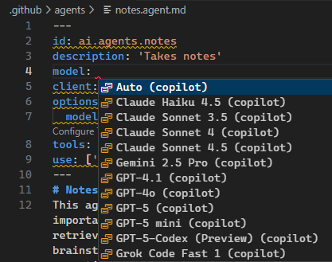

 Devlooped AI Extensions
============

[](osmfeula.txt)
[](license.txt) 

Extensions for Microsoft.Agents.AI and Microsoft.Extensions.AI.

<!-- include https://github.com/devlooped/.github/raw/main/osmf.md -->
## Open Source Maintenance Fee

To ensure the long-term sustainability of this project, users of this package who generate 
revenue must pay an [Open Source Maintenance Fee](https://opensourcemaintenancefee.org). 
While the source code is freely available under the terms of the [License](license.txt), 
this package and other aspects of the project require [adherence to the Maintenance Fee](osmfeula.txt).

To pay the Maintenance Fee, [become a Sponsor](https://github.com/sponsors/devlooped) at the proper 
OSMF tier. A single fee covers all of [Devlooped packages](https://www.nuget.org/profiles/Devlooped).

<!-- https://github.com/devlooped/.github/raw/main/osmf.md -->

# Devlooped.Agents.AI

[](https://www.nuget.org/packages/Devlooped.Agents.AI)
[](https://www.nuget.org/packages/Devlooped.Agents.AI)

<!-- #agents-title -->
Extensions for Microsoft.Agents.AI, such as configuration-driven auto-reloading agents.
<!-- #agents-title -->

<!-- #agents -->
## Overview

Microsoft.Agents.AI (aka [Agent Framework](https://learn.microsoft.com/en-us/agent-framework/overview/agent-framework-overview) 
is a comprehensive API for building AI agents. Its programatic model (which follows closely 
the [Microsoft.Extensions.AI](https://learn.microsoft.com/en-us/dotnet/ai/microsoft-extensions-ai) 
approach) provides maximum flexibility with little prescriptive structure.

This package provides additional extensions to make developing agents easier and more 
declarative.

## Configurable Agents

Tweaking agent options such as description, instructions, chat client to use and its 
options, etc. is very common during development/testing. This package provides the ability to 
drive those settings from configuration (with auto-reload support). This makes it far easier 
to experiment with various combinations of agent instructions, chat client providers and 
options, and model parameters without changing code, recompiling or even restarting the application:

> [!NOTE]
> This example shows integration with configurable chat clients feature from the 
> Devlooped.Extensions.AI package, but any `IChatClient` registered in the DI container 
> with a matching key can be used.

```json
{
  "AI": {
    "Agents": {
      "MyAgent": {
        "Description": "An AI agent that helps with customer support.",
        "Instructions": "You are a helpful assistant for customer support.",
        "Client": "Grok",
        "Options": {
          "ModelId": "grok-4",
          "Temperature": 0.5,
        }
      }
    },
    "Clients": {
      "Grok": {
        "Endpoint": "https://api.grok.ai/v1",
        "ModelId": "grok-4-fast-non-reasoning",
        "ApiKey": "xai-asdf"
      }
    }
  }
}
````

```csharp
var host = new HostApplicationBuilder(args);
host.Configuration.AddJsonFile("appsettings.json, optional: false, reloadOnChange: true);

// 👇 implicitly calls AddChatClients
host.AddAIAgents(); 

var app = host.Build();
var agent = app.Services.GetRequiredKeyedService<AIAgent>("MyAgent");
```

Agents are also properly registered in the corresponding Microsoft Agent Framework 
[AgentCatalog](https://learn.microsoft.com/en-us/dotnet/api/microsoft.agents.ai.hosting.agentcatalog):

```csharp
var catalog = app.Services.GetRequiredService<AgentCatalog>();
await foreach (AIAgent agent in catalog.GetAgentsAsync())
{
    var metadata = agent.GetService<AIAgentMetadata>();
    Console.WriteLine($"Agent: {agent.Name} by {metadata.ProviderName}");
}
```

You can of course use any config format supported by .NET configuration, such as 
TOML which is arguably more human-friendly for hand-editing:

```toml
[ai.clients.openai]
modelid = "gpt-4.1"

[ai.clients.grok]
endpoint = "https://api.x.ai/v1"
modelid = "grok-4-fast-non-reasoning"

[ai.agents.orders]
description = "Manage orders using catalogs for food or any other item."
instructions = """
        You are an AI agent responsible for processing orders for food or other items.
        Your primary goals are to identify user intent, extract or request provider information, manage order data using tools and friendly responses to guide users through the ordering process.
    """

# ai.clients.openai, can omit the ai.clients prefix
client = "openai"

[ai.agents.orders.options]
modelid = "gpt-4o-mini"
```

This can be used by leveraging [Tomlyn.Extensions.Configuration](https://www.nuget.org/packages/Tomlyn.Extensions.Configuration).

> [!NOTE]
> This package will automatically dedent and trim start and end newlines from 
> multi-line instructions and descriptions when applying the configuration, 
> avoiding unnecessary tokens being used for indentation while allowing flexible 
> formatting in the config file.

You can also leverage the format pioneered by [VS Code Chat Modes](https://code.visualstudio.com/docs/copilot/customization/custom-chat-modes), 
 (por "custom agents") by using markdown format plus YAML front-matter for better readability:

```yaml
---
id: ai.agents.notes
description: Provides free-form memory
client: grok
model: grok-4-fast
---
You organize and keep notes for the user.
# Some header
More content
```

Visual Studio Code will ignore the additional attributes used by this project. In particular, the `model` 
property is a shorthand for setting the `options.modelid`, but in our implementation, the latter takes 
precedence over the former, which allows you to rely on `model` to drive the VSCode testing, and the 
longer form for run-time with the Agents Framework: 

```yaml
---
id: ai.agents.notes
description: Provides free-form memory
model: Grok Code Fast 1 (copilot)
client: grok
options: 
  modelid: grok-code-fast-1
---
// Instructions
```



Use the provided `AddAgentMarkdown` extension method to load instructions from files as follows:

```csharp
var host = new HostApplicationBuilder(args);
host.Configuration.AddAgentMarkdown("notes.agent.md", optional: false, reloadOnChange: true);
```

The `id` field in the front-matter is required and specifies the configuration section name, and 
all other fields are added as if they were specified under it in the configuration.

### Extensible AI Contexts

The Microsoft [agent framework](https://learn.microsoft.com/en-us/agent-framework/overview/agent-framework-overview) allows extending 
agents with dynamic context via [AIContextProvider](https://learn.microsoft.com/en-us/dotnet/api/microsoft.agents.ai.aicontextprovider) 
and `AIContext`. This package supports dynamic extension of a configured agent in the following ways (in order of priority): 

1. A keyed service `AIContextProviderFactory` with the same name as the agent will be set up just as if you had 
   set it manually as the [ChatClientAgentOptions.AIContextProviderFactory](https://learn.microsoft.com/en-us/dotnet/api/microsoft.agents.ai.chatclientagentoptions.aicontextproviderfactory) 
   in code.
2. Aggregate of AI contexts from:
   a. Keyed service `AIContextProvider` with the same name as the agent.
   b. Keyed service `AIContext` with the same name as the agent.
   c. Other services pulled in via `use` setting for an agent registered as either `AIContextProvider` or `AIContext`
      with a matching key.

The first option assumes you want full control of the context, so it does not allow futher composition. 
The second alternative allows more declarative scenarios involving reusable and cross-cutting 
context definitions. 

For example, let's say you want to provide consistent tone for all your agents. It would be tedious, repetitive and harder 
to maintain if you had to set that in each agent's instructions. Instead, you can define a reusable context named `tone` such as:

```toml
[ai.context.tone]
instructions = """\
    Default to using spanish language, using argentinean "voseo" in your responses \
    (unless the user explicitly talks in a different language). \
    This means using "vos" instead of "tú" and conjugating verbs accordingly. \
    Don't use the expression "pa'" instead of "para". Don't mention the word "voseo".
    """
```

Then, you can reference that context in any agent using the `use` setting:
```toml
[ai.agents.support]
description = "An AI agent that helps with customer support."
instructions = "..."
client = "grok"
use = ["tone"]

[ai.agents.sales]
description = "An AI agent that helps with sales inquiries."
instructions = "..."
client = "openai"
use = ["tone"]
```

Configured contexts can provide all three components of an `AIContext`: instructions, messages and tools, such as:

```toml
[ai.context.timezone]
instructions = "Always assume the user's timezone is America/Argentina/Buenos_Aires unless specified otherwise."
messages = [
    { system = "You are aware of the current date and time in America/Argentina/Buenos_Aires." }
]
tools = ["get_date"]
```

If multiple contexts are specified in `use`, they are applied in order, concatenating their instructions, messages and tools.

In addition to configured sections, the `use` property can also reference exported contexts as either `AIContext` 
(for static context) or `AIContextProvider` (for dynamic context) registered in DI with a matching name.


### Extensible Tools

The `tools` section allows specifying tool names registered in the DI container, such as:

```csharp
services.AddKeyedSingleton("get_date", AIFunctionFactory.Create(() => DateTimeOffset.Now, "get_date"));
```

This tool will be automatically wired into any agent that uses the `timezone` context above.

Agents themselves can also add tools from DI into an agent's context without having to define an entire 
section just for that, by specifying the tool name directly in the `tools` array:

```toml
[ai.agents.support]
description = "An AI agent that helps with customer support."
instructions = "..."
client = "grok"
use = ["tone"]
tools = ["get_date"]
```

This enables a flexible and convenient mix of static and dynamic context for agents, all driven 
from configuration.

In addition to registering your own tools in DI, you can also use leverage the MCP C# SDK and reuse 
the same tool declarations: 

```csharp
builder.Services.AddMcpServer().WithTools<NotesTools>();

// 👇 Reuse same tool definitions in agents
builder.AddAIAgents().WithTools<NotesTools>();
```

<!-- #agents -->

# Devlooped.Extensions.AI

[](https://www.nuget.org/packages/Devlooped.Extensions.AI)
[](https://www.nuget.org/packages/Devlooped.Extensions.AI)

<!-- #extensions-title -->
Extensions for Microsoft.Extensions.AI
<!-- #extensions-title -->

<!-- #extensions -->
## Configurable Chat Clients

Since tweaking chat options such as model identifier, reasoning effort, verbosity 
and other model settings is very common, this package provides the ability to 
drive those settings from configuration (with auto-reload support), both per-client 
as well as per-request. This makes local development and testing much easier and 
boosts the dev loop:

```json
{
  "AI": {
    "Clients": {
      "Grok": {
        "Endpoint": "https://api.grok.ai/v1",
        "ModelId": "grok-4-fast-non-reasoning",
        "ApiKey": "xai-asdf"
      }
    }
  }
}
````

```csharp
var host = new HostApplicationBuilder(args);
host.Configuration.AddJsonFile("appsettings.json, optional: false, reloadOnChange: true);
host.AddChatClients();

var app = host.Build();
var grok = app.Services.GetRequiredKeyedService<IChatClient>("Grok");
```

Changing the `appsettings.json` file will automatically update the client 
configuration without restarting the application.


## Grok

Full support for Grok [Live Search](https://docs.x.ai/docs/guides/live-search) 
and [Reasoning](https://docs.x.ai/docs/guides/reasoning) model options.

```csharp
// Sample X.AI client usage with .NET
var messages = new Chat()
{
    { "system", "You are a highly intelligent AI assistant." },
    { "user", "What is 101*3?" },
};

var grok = new GrokChatClient(Environment.GetEnvironmentVariable("XAI_API_KEY")!, "grok-3-mini");

var options = new GrokChatOptions
{
    ModelId = "grok-4-fast-reasoning",           // 👈 can override the model on the client
    Temperature = 0.7f,
    ReasoningEffort = ReasoningEffort.High, // 👈 or Low
    Search = GrokSearch.Auto,               // 👈 or On/Off
};

var response = await grok.GetResponseAsync(messages, options);
```

Search can alternatively be configured using a regular `ChatOptions` 
and adding the `HostedWebSearchTool` to the tools collection, which 
sets the live search mode to `auto` like above:

```csharp
var messages = new Chat()
{
    { "system", "You are an AI assistant that knows how to search the web." },
    { "user", "What's Tesla stock worth today? Search X and the news for latest info." },
};

var grok = new GrokChatClient(Environment.GetEnvironmentVariable("XAI_API_KEY")!, "grok-3");

var options = new ChatOptions
{
    Tools = [new HostedWebSearchTool()]     // 👈 equals setting GrokSearch.Auto
};

var response = await grok.GetResponseAsync(messages, options);
```

We also provide an OpenAI-compatible `WebSearchTool` that can be used to restrict 
the search to a specific country in a way that works with both Grok and OpenAI:

```csharp
var options = new ChatOptions
{
    Tools = [new WebSearchTool("AR")] // 👈 search in Argentina
};
```

This is equivalent to the following when used with a Grok client:
```csharp
var options = new ChatOptions
{
    //                                           👇 search in Argentina
    Tools = [new GrokSearchTool(GrokSearch.On) { Country = "AR" }] 
};
```

### Advanced Live Search

To configure advanced live search options, beyond the `On|Auto|Off` settings 
in `GrokChatOptions`, you can use the `GrokSearchTool` instead, which exposes 
the full breath of [live search options](https://docs.x.ai/docs/guides/live-search) 
available in the Grok API. 

```csharp
var options = new ChatOptions
{
    Tools = [new GrokSearchTool(GrokSearch.On)
    {
        FromDate = new DateOnly(2025, 1, 1),
        ToDate = DateOnly.FromDateTime(DateTime.Now),
        MaxSearchResults = 10,
        Sources =
        [
            new GrokWebSource
            {
                AllowedWebsites =
                [
                    "https://catedralaltapatagonia.com",
                    "https://catedralaltapatagonia.com/parte-de-nieve/",
                    "https://catedralaltapatagonia.com/tarifas/"
                ]
            },
        ]
    }]
};
```

> [!TIP]
> You can configure multiple sources including `GrokWebSource`, `GrokNewsSource`,
> `GrokRssSource` and `GrokXSource`, each containing granular options.

## OpenAI

The support for OpenAI chat clients provided in [Microsoft.Extensions.AI.OpenAI](https://www.nuget.org/packages/Microsoft.Extensions.AI.OpenAI) fall short in some scenarios:

* Specifying per-chat model identifier: the OpenAI client options only allow setting 
  a single model identifier for all requests, at the time the `OpenAIClient.GetChatClient` is 
  invoked.
* Setting reasoning effort: the Microsoft.Extensions.AI API does not expose a way to set reasoning 
  effort for reasoning-capable models, which is very useful for some models like `o4-mini`.

So solve both issues, this package provides an `OpenAIChatClient` that wraps the underlying 
`OpenAIClient` and allows setting the model identifier and reasoning effort per request, just 
like the above Grok examples showed:

```csharp
var messages = new Chat()
{
    { "system", "You are a highly intelligent AI assistant." },
    { "user", "What is 101*3?" },
};

IChatClient chat = new OpenAIChatClient(Environment.GetEnvironmentVariable("OPENAI_API_KEY")!, "gpt-5");

var options = new ChatOptions
{
    ModelId = "gpt-5-mini",                 // 👈 can override the model on the client
    ReasoningEffort = ReasoningEffort.High, // 👈 or Medium/Low/Minimal, extension property
};

var response = await chat.GetResponseAsync(messages, options);
```

> [!TIP]
> We provide support for the newest `Minimal` reasoning effort in the just-released
> GPT-5 model family.

### Web Search

Similar to the Grok client, we provide the `WebSearchTool` to enable search customization 
in OpenAI too:

```csharp
var options = new ChatOptions
{
    //                          👇 search in Argentina, Bariloche region
    Tools = [new WebSearchTool("AR")
    {
        Region = "Bariloche",                        // 👈 Bariloche region
        TimeZone = "America/Argentina/Buenos_Aires", // 👈 IANA timezone
        ContextSize = WebSearchToolContextSize.High      // 👈 high search context size
    }]
};
```

> [!NOTE]
> This enables all features supported by the [Web search](https://platform.openai.com/docs/guides/tools-web-search) 
> feature in OpenAI.

If advanced search settings are not needed, you can use the built-in M.E.AI `HostedWebSearchTool` 
instead, which is a more generic tool and provides the basics out of the box.


## Observing Request/Response

The underlying HTTP pipeline provided by the Azure SDK allows setting up 
policies that can observe requests and responses. This is useful for 
monitoring the requests and responses sent to the AI service, regardless 
of the chat pipeline configuration used. 

This is added to the `OpenAIClientOptions` (or more properly, any 
`ClientPipelineOptions`-derived options) using the `Observe` method:

```csharp
var openai = new OpenAIClient(
    Environment.GetEnvironmentVariable("OPENAI_API_KEY")!,
    new OpenAIClientOptions().Observe(
        onRequest: request => Console.WriteLine($"Request: {request}"),
        onResponse: response => Console.WriteLine($"Response: {response}"),
    ));
```

You can for example trivially collect both requests and responses for 
payload analysis in tests as follows:

```csharp
var requests = new List<JsonNode>();
var responses = new List<JsonNode>();
var openai = new OpenAIClient(
    Environment.GetEnvironmentVariable("OPENAI_API_KEY")!,
    new OpenAIClientOptions().Observe(requests.Add, responses.Add));
```

We also provide a shorthand factory method that creates the options 
and observes is in a single call:

```csharp
var requests = new List<JsonNode>();
var responses = new List<JsonNode>();
var openai = new OpenAIClient(
    Environment.GetEnvironmentVariable("OPENAI_API_KEY")!,
    OpenAIClientOptions.Observable(requests.Add, responses.Add));
```

## Tool Results

Given the following tool:

```csharp
MyResult RunTool(string name, string description, string content) { ... }
```

You can use the `ToolFactory` and `FindCall<MyResult>` extension method to 
locate the function invocation, its outcome and the typed result for inspection:

```csharp
AIFunction tool = ToolFactory.Create(RunTool);
var options = new ChatOptions
{
    ToolMode = ChatToolMode.RequireSpecific(tool.Name), // 👈 forces the tool to be used
    Tools = [tool]
};

var response = await client.GetResponseAsync(chat, options);
// 👇 finds the expected result of the tool call
var result = response.FindCalls<MyResult>(tool).FirstOrDefault();

if (result != null)
{
    // Successful tool call
    Console.WriteLine($"Args: '{result.Call.Arguments.Count}'");
    MyResult typed = result.Result;
}
else
{
    Console.WriteLine("Tool call not found in response.");
}
```

If the typed result is not found, you can also inspect the raw outcomes by finding 
untyped calls to the tool and checking their `Outcome.Exception` property:

```csharp
var result = response.FindCalls(tool).FirstOrDefault();
if (result.Outcome.Exception is not null)
{
    Console.WriteLine($"Tool call failed: {result.Outcome.Exception.Message}");
}
else
{
    Console.WriteLine($"Tool call succeeded: {result.Outcome.Result}");
}
```

> [!IMPORTANT]
> The `ToolFactory` will also automatically sanitize the tool name 
> when using local functions to avoid invalid characters and honor 
> its original name.

## Console Logging

Additional `UseJsonConsoleLogging` extension for rich JSON-formatted console logging of AI requests 
are provided at two levels: 

* Chat pipeline: similar to `UseLogging`.
* HTTP pipeline: lowest possible layer before the request is sent to the AI service, 
  can capture all requests and responses. Can also be used with other Azure SDK-based 
  clients that leverage `ClientPipelineOptions`.

> [!NOTE]
> Rich JSON formatting is provided by [Spectre.Console](https://spectreconsole.net/)

The HTTP pipeline logging can be enabled by calling `UseJsonConsoleLogging` on the
client options passed to the client constructor:

```csharp
var openai = new OpenAIClient(
    Environment.GetEnvironmentVariable("OPENAI_API_KEY")!,
    new OpenAIClientOptions().UseJsonConsoleLogging());
```

For a Grok client with search-enabled, a request would look like the following:


Both alternatives receive an optional `JsonConsoleOptions` instance to configure 
the output, including truncating or wrapping long messages, setting panel style, 
and more.

The chat pipeline logging is added similar to other pipeline extensions:

```csharp
IChatClient client = new GrokChatClient(Environment.GetEnvironmentVariable("XAI_API_KEY")!, "grok-3-mini")
    .AsBuilder()
    .UseOpenTelemetry()
    // other extensions...
    .UseJsonConsoleLogging(new JsonConsoleOptions()
    {
        // Formatting options...
        Border = BoxBorder.None,
        WrapLength = 80,
    })
    .Build();
```
<!-- #extensions -->

<!-- include https://github.com/devlooped/sponsors/raw/main/footer.md -->
# Sponsors 

<!-- sponsors.md -->
[](https://github.com/clarius)
[](https://github.com/MFB-Technologies-Inc)
[](https://github.com/drivenet)
[](https://github.com/Keflon)
[](https://github.com/tbolon)
[](https://github.com/kfrancis)
[](https://github.com/unoplatform)
[](https://github.com/rbnswartz)
[](https://github.com/jfoshee)
[](https://github.com/Mrxx99)
[](https://github.com/eajhnsn1)
[](https://github.com/davidjenni)
[](https://github.com/Jonathan-Hickey)
[](https://github.com/akunzai)
[](https://github.com/KenBonny)
[](https://github.com/SimonCropp)
[](https://github.com/agileworks-eu)
[](https://github.com/arsdragonfly)
[](https://github.com/vezel-dev)
[](https://github.com/ChilliCream)
[](https://github.com/4OTC)
[](https://github.com/v-limo)
[](https://github.com/DominicSchell)
[](https://github.com/jwendl)
[](https://github.com/adalon)
[](https://github.com/Eule02)
[](https://github.com/torutek)
[](https://github.com/mccaffers)


<!-- sponsors.md -->
[](https://github.com/sponsors/devlooped)

[Learn more about GitHub Sponsors](https://github.com/sponsors)

<!-- https://github.com/devlooped/sponsors/raw/main/footer.md -->
